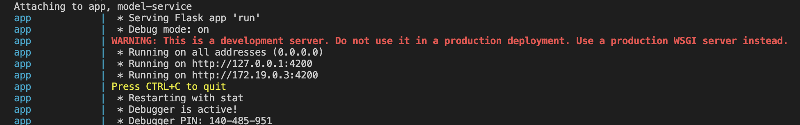

REMLA Group Project | Group 18
====

## How to run

### Assignment 3

#### Kubernetes deployment
Make sure now you're under /operation, and then you have vagrant booted by running:

```bash
cd VM

vagrant up

ansible-playbook -u vagrant -i 192.168.56.100, provisioning/finalization.yml

ansible-playbook -u vagrant -i 192.168.56.100, provisioning/cluster-configuration.yml
```
then connect to the VM using SSH:
```bash
vagrant ssh ctrl
```

Now generate the k8s SECRET(replace the GITHUB_USERNAME, GHCR_PAT and your@email.com with your own):

```bash
kubectl create secret docker-registry ghcr-secret \
--docker-server=ghcr.io \
--docker-username=GITHUB_USERNAME \
--docker-password=GHCR_PAT \
--docker-email=your@email.com
```

This will create the pods and services for the app and model service. You can check the status of the pods and services using kubectl get pods and kubectl get services commands. The output should look like this:

```bash
vagrant@ctrl:~/model-service$ kubectl get pods -w
NAME                                    READY   STATUS    RESTARTS   AGE
team18-app-575598cb84-m99t4             1/1     Running   0          15m
team18-model-service-7789876bf7-gwwxz   1/1     Running   0          72s


vagrant@ctrl:~/model-service$ kubectl get services
NAME                   TYPE        CLUSTER-IP      EXTERNAL-IP   PORT(S)          AGE
kubernetes             ClusterIP   10.96.0.1       <none>        443/TCP          39m
team18-app             NodePort    10.100.5.251    <none>        4200:30001/TCP   26m
team18-model-service   ClusterIP   10.103.48.115   <none>        5050/TCP         26m


vagrant@ctrl:~/model-service$ kubectl get nodes -o wide
NAME     STATUS   ROLES           AGE   VERSION   INTERNAL-IP      EXTERNAL-IP   OS-IMAGE             KERNEL-VERSION     CONTAINER-RUNTIME
ctrl     Ready    control-plane   39m   v1.32.4   192.168.56.100   <none>        Ubuntu 24.04.2 LTS   6.8.0-53-generic   containerd://1.7.24
node-1   Ready    <none>          37m   v1.32.4   192.168.56.101   <none>        Ubuntu 24.04.2 LTS   6.8.0-53-generic   containerd://1.7.24
node-2   Ready    <none>          35m   v1.32.4   192.168.56.102   <none>        Ubuntu 24.04.2 LTS   6.8.0-53-generic   containerd://1.7.24
```

#### Monitoring
To monitor the app, you can use the Prometheus and Grafana setup. The Prometheus server is already configured to scrape the app metrics. You can access the Prometheus UI by running:

```bash
kubectl -n istio-system port-forward deployment/prometheus 9090
```
Now the Prometheus server is running on port 9090 on the virtual machine. To run the Prometheus UI on your local machine, you need to forward the port from the VM to your local machine. You can do this by running:

```bash
ssh -L 9090:localhost:9090 vagrant@192.168.56.100
```

Then, open your browser and go to [http://localhost:9090](http://localhost:9090) to access the Prometheus UI, the ssh terminal will show you the logs of the Prometheus server, like this:

```
vagrant@ctrl:~$ kubectl -n istio-system port-forward deployment/prometheus 9090
Forwarding from 127.0.0.1:9090 -> 9090
Forwarding from [::1]:9090 -> 9090
Handling connection for 9090
Handling connection for 9090
Handling connection for 9090
```

### Assignment 2
For assignment 2, here are the steps to run the project:

1. Make sure you're in `./VM` folder, by doing:

```bash
cd VM
```

2. To boot all the VMs, use the following:

```bash
vagrant up
```

To validate the running process, run

```bash
vagrant status
```
If it successfully runs, you should get the output like this:

```
Current machine states:

ctrl                      running (virtualbox)
node-1                    running (virtualbox)
node-2                    running (virtualbox)

This environment represents multiple VMs. The VMs are all listed above with their current state. For more information about a specific VM, run `vagrant status NAME`.

```
3. To finalize the cluster setup, run the following command from the `./VM` folder:
```bash
ansible-playbook -u vagrant -i 192.168.56.100, provisioning/finalization.yml
```

4. When you finish working, you can permanently delete the VMs using:
```bash
vagrant destroy -f
```
Note: this means next time you need to build the VMs from scratch, which takes time.

### Assignment 1
For assignment 1, we have created a docker-compose file that allows you to run the entire project with a single command.
Under **operation** folder, run:
```bash
docker-compose up
```

Then you should be able to see the web page running at [http://127.0.0.1:4200/](http://127.0.0.1:4200/).

> **Note:** This port is the default. To ensure it's the same port on your computer, check the terminal output, as shown in the image below:




## Relevant repositories

The following repositories are relevant for our REMLA group 18 project:

- [operation](https://github.com/remla25-team18/operation) - stores models and their versions, pointers to other repositories, general instructions how to run the app and a docker-compose file to run the whole project.
- [app](https://github.com/remla25-team18/app) - the app repository that use Flask framework to contain the frontend of the application, which is a web app that allows users to interact with the model and provide feedback and the backend of the application.
- [model-service](https://github.com/remla25-team18/model-service) - the model service, which is a REST API that serves the model and is responsible for sending generating predictions for requested comments.
- [model-training](https://github.com/remla25-team18/model-training) - the component that is responsible for training the model and generating a model version.
- [lib-ml](https://github.com/remla2) - the library that contains a method to process input data.
- [lib-version](https://github.com/remla25-team18/lib-version) - the library that can read its own version.

## Progress log

### Assignment 3

- **[Kubernetes Usage]** Deployed the app and model service to the Kubernetes cluster

- **[Helm Installation]** Created an Helm chart for the deployment

- **[App Monitoring]** The app has more than 3 app-specific metrics, of the types gauge and counter, that can be used to reason about user behaviour or model performance. The metrics are automatically discovered and collected by Prometheus through a service monitor. 

- **[Grafana]** Not yet implemented

### Assignment 2

- **[Setting up (Virtual) Infrastructure]** We created a Vagrantfile that sets up a virtual machine with Ansible installed. The Vagrantfile is located in the `./VM` folder. The Ansible playbook is located in the `provisioning` folder. All the requirements are met.

- **[Setting up Software Environment]** The Ansible playbook is designed to ensure idempotent provisioning by using several built-in modules. It registers variables to share values between different tasks, enabling seamless communication across the provisioning process. Additionally, the playbook incorporates automation with loops, such as copying multiple SSH keys. 

- **[Setting up Kubernetes]** 

### Assignment 1
- **[Basic Requirements]** We created a structured organization with several repositories that are responsible for different parts of the project. Operation repository contains a README.md, provides the steps to run the application and docker-compose.yml file to run the whole project. The app has a frontend and a backend which allows a user to interact with the model and provide feedback.
- **[Automated Release Process]** We created a workflow which automatically versions the artifacts and increases patch versions and bumps the version to the next pre-release version. Main is set to a pre-release after a stable release.
- **[Software Reuse in Libraries]** We released libraries lib-version and lib-ml through GitHub packages. lib-ml is reused in both model-training and model-service. A trained model is not part of a container image. 
- **[Exposing a Model via REST]** We used REST API to communicate between the app and model-service, also within the app. DNS name and port are defined as ENV variables. All server endpoints have a well-defined API definition that follows Open API Specification. 
- **[Docker Compose Operation]** We added an attempt to configure a docker-compose file to run the whole project.