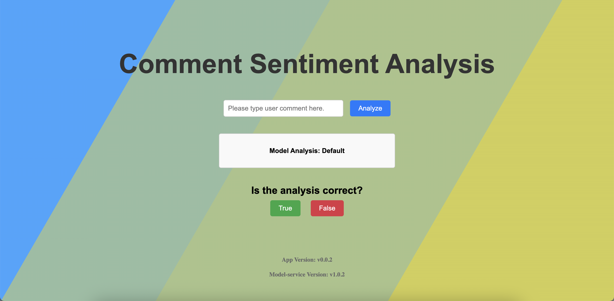
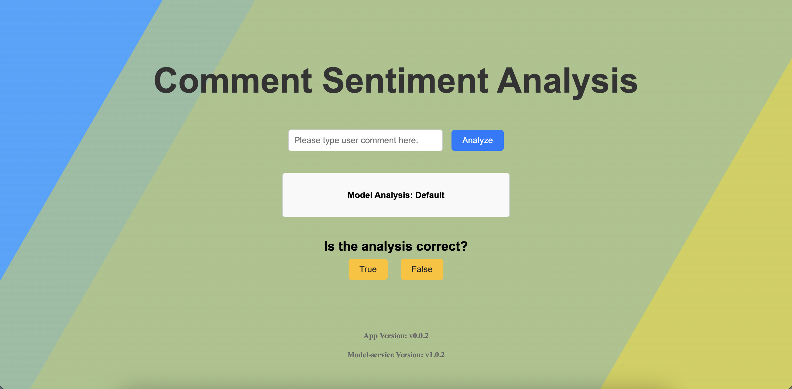
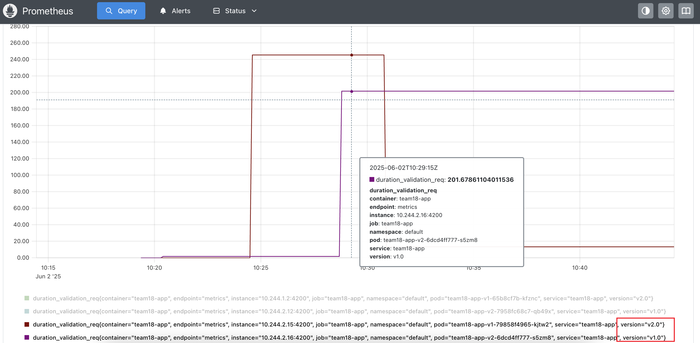
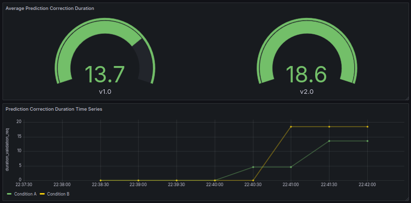

# Continuous Experimentation

## 1. Objective

We want to determine whether users click the buttons faster in a UI where:
- Condition A: The "True" button is green and the "False" button is red.
- Condition B: Both buttons are the same nautral color yellow.

The images below show our application in both conditions:

  
**Figure 1: Condition A**

  
**Figure 2: Condition B**

 

## 2. Hypothesis

People naturally associate the color green with "true" or "correct", and the color red with "false" or "wrong". As a result, when buttons are colored green and red, users often rely on color alone to make a quick choice, sometimes without fully reading the button text. By making both buttons the same neutral color (yellow), there are no automatic associations and users have to read the text before making a selection. With that in mind, we propose the following hypothesis:

**Users will click the buttons in Condition A faster than in Condition B.**

This is a falsifiable hypothesis and can be tested using collected interaction time metrics.

## 3. Experimental Design

- We deployed **two versions** of the application:
  - Version A: Green/Red buttons
  - Version B: Yellow/Yellow buttons
- Each version runs in a separate Kubernetes deployment.
- Both versions expose an HTTP endpoint `/metrics`.
- The metric used to test the hypothesis is `duration_validation_req`, which measures the time it takes for the user to correct the predition. This is timed from the moment the model predition is presented back until the moment the user clicks the one of the prediction correction buttons (True or False).

## 4. Monitoring and Visualization

In Prometheus, you can query the metric `duration_validation_req` to compare the two versions. The `version` label will indicate which version of the app the metric belongs to.

Grafana provides two key visualizations. At the top is the average duration of prediction corrections per condition, being v1.0 correspondant to Condition A and v2.0 to Condition B. At the bottom, there is a time series of the prediction corrections made. 

## 5. Conclusion

This experiment helps us determine if the color of the predition assessment buttons affects user interaction speed.

The criteria used to access this is the `duration_validation_req` metric. It measures the time it takes a user to assess the predition received and classify if the predition was correct or not.

With the support of the grafana dashboard, the hypothesis can be proven if:
- The average duration of prediction corrections from Condition A is smaller than Condition B, on the top graph;
- The yellow line, corresponding to Condition A, is mostly below of the green line, corresponding to Condition B.
Otherwise, the hypothesis is refuted.