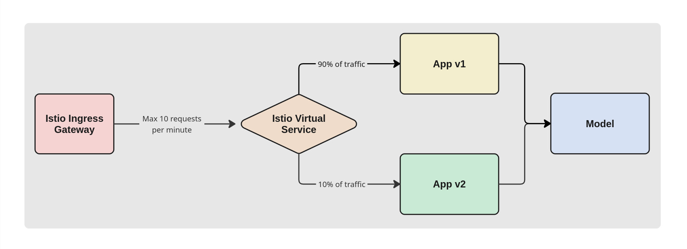

# Deployment Documentation

This file aims to conceptially document the final deployment of REMLA's group 18 review sentiment analysis system, in terms of the deployment structure and data flow. After studying the documentation, an outsider (e.g. a new team member) should have sufficient understanding of the overall design to contribute in a design discussion.

## Deployment Structure
Our application follows a microservices architecture, deployed on Kubernetes using Helm. An Istio service mesh is employed to handle communication between microservices and providing traffic management.

 

  
**Figure 1: Deployment Structure**

 

As shown in Figure 1, our kubernetes cluster is composed of:

Istio Ingress Layer
- Istio ingress gateway: Provides an entry point to the application running in the istio mesh.
- Istio virtual service: Routes incoming traffic to the services based on the incoming request.

App Layer
- App service: Routes the requests to the pods.
- App pods (v1 and v2): Invokes the different versions of app docker images.

Model Service Layer
- Model service: Routes the requests to the pod.
- Model pod: Invokes the model docker image.

Monitoring Layer
- Kubernetes dashboard: Provides an overview of the cluster resources.
- Prometheus: Scrape metrics from the application, through a service monitor.
- Grafana: Provides real-time visualization of the metrics collected by Prometheus.

## Data Flow

The data flow of an incoming request is represented in the following sequence diagram:

  
**Figure 2: Data Flow**

 

In our experiment, dynamic traffic routing is achieved using:
- Istio ingress gateway: load balancer that handles incoming HTTPS traffic (requests) to the mesh.
- Rate limiting: an Envoy filter limits the amount of requests per minute to 10.
- Istio virtual service: with a destination rule, traffic is split 90% going to app version 1 and 10% to app version 2. Sticky sessions are used to ensure the versions are consistent.
- Model communication: an HTTP POST request gets the review sentiment prediction.
This can be visualized in the diagram below:

  
**Figure 3: Dynamic Traffic Routing**

 
