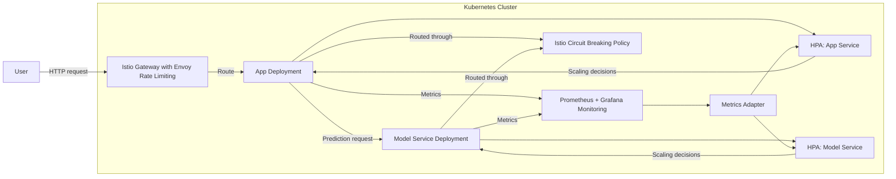

# Extension Proposal: Autoscaling and Circuit Breaking

## Critical Reflection

Our project is a sentiment analysis application that operates within a Kubernetes cluster. The system is managed using Helm for deployments and utilizes Istio (version 1.25.2) for traffic routing, rate limiting, sticky sessions, and monitoring through Prometheus and Grafana.

If our deployment were to be used in production, one of the challenges it would face is the lack of adaptive scaling and resilience mechanisms. We identify this challenge as a critical release-engineering related shortcoming in our current setup.

There are two notable effects of the shortcoming. First, resource utilization is inefficient since pods maintain a fixed replica count irrespective of the actual load. This results in unnecessary computational expenses during periods of low or no traffic. Second, the system's resilience suffers because without appropriate mechanisms, a failing model service can cause cascading failures that negatively impact the web app and overall system performance. Such instability and inefficient resource allocation compromise both user experience and cost-effectiveness, especially under fluctuating demand. This issue is closely related to the deployment and release engineering practices, as it affects how the system scales and maintains stability in production environments.

## Proposed Extension

To address these challenges, team 18 proposes to extend the current deployment and release engineering approach by introducing Kubernetes autoscaling [^1] and a circuit breaking mechanism [^2].

Kubernetes supports vertical and horizontal autoscaling, with Horizontal Pod Autoscaling (HPA) [^3] being particularly relevant for our use case. 

Horizontal Pod Autoscaling automatically adjusts the number of pod replicas in a deployment based on user-defined metrics (i.e. CPU/memory utilization). This allows the system to dynamically scale up during high traffic periods and scale down when demand decreases.

Whenever traffic spikes, additional pods are created to handle the load, while during idle times, the number of pods decreases to minimize resource wastage and reduce costs. By integrating autoscaling into the Helm charts, the deployment process remains consistent and reproducible.

To implement Horizontal Pod Autoscaling, we would configure the Kubernetes autoscaling API (`autoscaling/v2`) to automatically adjust replica count for `app` and `model-service` deployments. To configure the scaling, we would define a `HoizontalPodAutscaler` with a `scaleTargetRef` spec to 1) explicitly target the deployments we want to scale; 2) specify the metrics we want to monitor for scaling decisions and 3) set the threshold metric values for scaling actions. For example, if CPU usage exceeds 50%, the system will gradually scale out until the target is met according to the rule:
$$
desiredReplicas = \lceil currentReplicas × \frac{currentMetricValue}{desiredMetricValue} \rceil
$$

An example configuration for the `HorizontalPodAutoscaler` targeting the `app-v1` deployment is as follows:

```yaml
apiVersion: autoscaling/v2beta2
kind: HorizontalPodAutoscaler
metadata:
  name: team18-app-v1-hpa
  namespace: default
spec:
  scaleTargetRef:
    apiVersion: apps/v1
    kind: Deployment
    name: team18-app-v1
  minReplicas: 1
  maxReplicas: 10
  metrics:
  - type: Resource
    resource:
      # scale out when CPU usage exceeds 50%
      name: cpu
      target:
        type: Utilization
        averageUtilization: 50
```

The Kubernetes controller continuously monitors these metrics through Prometheus and adjusts the pod count in real time. This logic would be templated inside our existing Helm chart so that deployment stays reproducible.

Circuit breaking is a pattern for creating resilient microservice applications. To incorporate circuit breaking, an Istio’s `DestinationRule` needs to be configured. Circuit breakers limit the number of concurrent connections and pending requests to model service pods, and eject unhealthy instances temporarily. This protects the app from instability caused by a failing or overloaded model service (or the other way around), enhancing overall system robustness.

Together, these extensions will improve resource efficiency and operational reliability, directly improving the deployment process and system behavior in production.

## Extension In Cluster Diagram



This architecture demonstrates how the gateway routes user requests to the app service, which in turn queries the model service for predictions. Both services report metrics to the monitoring stack. The autoscalers adjust pod replicas according to load, while Istio’s rate limiting and circuit breakers govern traffic flow and resilience.

# Experiment Design
Once the proposed extension is implemented, it is important to validate that it is affectively addressing the identified challenges. To simulate realistic traffic patterns and variable load conditions, a load testing tool such as K6[^4] can be used. The experiment should consist of two phases: a baseline measurement without the proposed extensions and a subsequent measurement after implementing autoscaling and circuit breaking.

During the baseline phase, various system metrics need to be collected under various controlled load conditions (i.e. deployment CPU utilization, number of active pods, request latency, error rates, etc.).  

During the improvement phase, the metrics such as CPU utilization, etc. need to be recorded over an extended period, capturing both peak and idle traffic patterns. The experiment should focus on observing how pod replica counts dynamically adjust, whether CPU utilization stabilizes near target thresholds, and if request latency and error rates improve, especially during traffic spikes (to check if circuit breaking starts to take effect). Additional observations may include the occurrence of circuit breaker events and their effect on system stability.

By comparing the metrics before and after the extension, the benefits of autoscaling in cost optimization and circuit breaking in system robustness can be objectively assessed.


[^1]: Kubernetes Autoscaling Workloads: https://kubernetes.io/docs/concepts/workloads/autoscaling/
[^2]: Istio Circuit Breaking: https://istio.io/latest/docs/tasks/traffic-management/circuit-breaking/
[^3]: Kubernetes Horizontal Pod Autoscaler: https://kubernetes.io/docs/tasks/run-application/horizontal-pod-autoscale/
[^4]: K6 : https://k6.io/